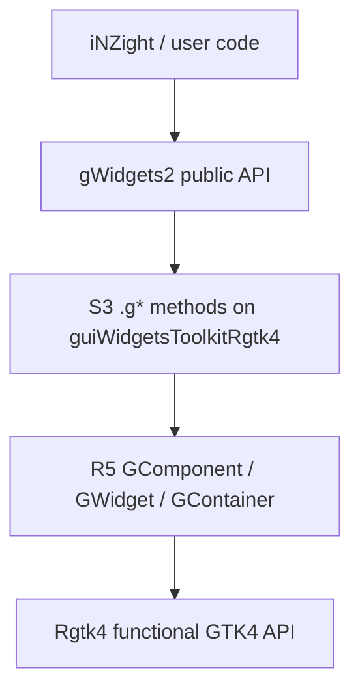

# Architecture

## Role in the stack

`gWidgets2Rgtk4` is a **toolkit adapter**. User and application code talk to [gWidgets2](../../gWidgets2); this package supplies the GTK4 implementation.



## Toolkit discovery

gWidgets2 `guiToolkit()`:

1. Reads `options("guiToolkit")` or prompts among installed `gWidgets2*` packages.
2. Strips the `gWidgets2` prefix → name `"Rgtk4"`.
3. `require("gWidgets2Rgtk4")`.
4. Instantiates `new("guiWidgetsToolkitRgtk4", toolkit="Rgtk4")`.

Public constructors then dispatch on the toolkit S4 class:

```r
gbutton(...)                         # gWidgets2
  → .gbutton(toolkit, ...)           # S3 generic
  → .gbutton.guiWidgetsToolkitRgtk4  # this package
  → GButton$new(...)                 # reference class
```

There is no separate registration API — naming convention is the registry.

## Class hierarchy

Mirror of gWidgets2RGtk2 (documented in its `GComponent.R`):

```
GComponent                          # tag, visible, enabled, focus, handlers
  ├── GWidget                       # value interface, change_signal
  │     ├── GButton, GLabel, GEdit, …
  │     └── …
  └── GContainer                    # children, add/delete
        ├── GWindow
        ├── GGroup → GFrame → GExpandGroup
        ├── GLayout, GNotebook, GStacked, GPanedGroup
        └── …
```

Inheritance from gWidgets2 is via `gWidgets2::BasicToolkitInterface` and the Observable / handler machinery — not by subclassing gWidgets2’s own widget classes (those names are re-defined in the toolkit package).

### Dual GTK objects

Many widgets keep:

- `widget` — interactive control
- `block` — outer object used for packing into parents

In RGtk2 this often meant wrapping with `GtkEventBox`. In GTK4, prefer `widget == block` unless a wrapper is required (e.g. scroll, clickable label via gesture).

## Signals and handlers

gWidgets2 handlers (`addHandlerChanged`, etc.) flow through Observable observers on the refclass. The toolkit connects once per signal via `connect_to_toolkit_signal()`:

| RGtk2 | Rgtk4 |
|-------|--------|
| `gSignalConnect(obj, signal, f, data=.self, user.data.first=TRUE)` | `gSignalConnectR(obj, signal, function(...) { ... .self ... })` |

Default change signal is stored in `change_signal` (`"clicked"`, `"changed"`, `"toggled"`, …).

## Package bootstrap

`.onLoad` / `.onAttach` should:

1. Ensure GTK is initialized (`Rgtk4::gtkInit()`).
2. Start the R/GTK event loop (`Rgtk4::gtkStartEventLoop()`).
3. Load icon mappings (`load_gwidget_icons()`).

## File layout (target)

Aligned with gWidgets2RGtk2 Collate:

- Bootstrap: `gWidgets2Rgtk4-package.R`, `misc.R`, `gtk-misc.R`, `GComponent.R`, `GContainer.R`, `GWidget.R`, `aaa.R`, `startup.R`, `icons.R`
- One file per constructor family: `gbutton.R`, `gwindow.R`, `dialogs.R`, …
- `docs/` — design docs (not in the installed package)

## Design rules

1. **gWidgets2 API stability first** — behavioral parity over GTK purity.
2. **Call Rgtk4 directly** — camelCase `gtkXxxNew` / `gtkXxxSetYyy`, not a compatibility `$` facade.
3. **Keep refclass names familiar** (`GButton`, …) where practical for later app migration; do not treat `:::` as public API.
4. **Fail loudly** for unimplemented constructors during the port.
